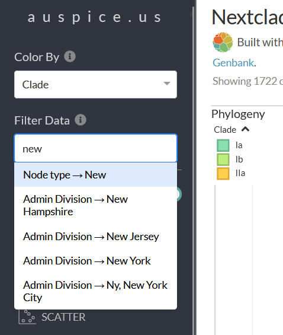
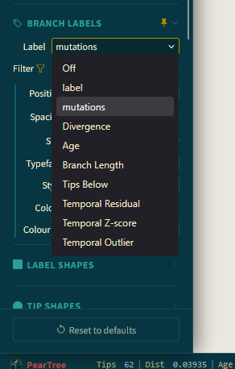

[Back to Day 03 overview](README.md)

# From Genomes to Clades and Trees

## Learning Objectives

By the end of this session, you should be able to:

1. Explain what analyses can be done after genome reconstruction.
2. Inspect a Nextclade report for clade assignment, mutations, missing data, and quality warnings.
3. Distinguish between **phylogenetic placement** and **phylogenetic trees**.
4. Visualize a tree in Auspice or PearTree.
5. Use tree position, QC results, and metadata together to make cautious interpretations.

## Before We Start

This lesson assumes that:

- you are working inside the workshop environment
- the workshop repository is located at `~/2026-Workshop-Ghana`
- the input samplesheets have already been prepared
- the required conda environments and workflow files are already available

Start from the root directory of the workshop:

```bash
cd ~/2026-Workshop-Ghana
```

## Today's Workflow: `omnifluss_downstream`

Now we use a downstream pipeline called `omnifluss_downstream`.

This pipeline starts from reconstructed genomes and creates outputs that help us answer questions such as:

- Which clade or lineage does each sample belong to?
- Are any samples low quality?
- Which mutations are present compared with the reference?
- Where do our samples fall in a reference tree?
- What tree do we reconstruct from our own analysis?

Because we do not yet know which mpox clades are present, we use the Nextclade dataset for **all mpox clades**.

## Input Samplesheet

The pipeline input genomes are listed in a samplesheet. A prepared samplesheet is available for this lesson.

Inspect it before running the pipeline:

```bash
mkdir -p analysis/omnifluss_downstream/input
cd analysis/omnifluss_downstream
cp  ~/2026-Workshop-Ghana/assets/samplesheet_ill_ods.csv input
cat input/samplesheet_ill_ods.csv
```

Discuss briefly:

- How many samples are listed?
- What columns are present?
- Do the sample names look consistent?
- Are the input file paths readable and understandable?

## Run the Downstream Pipeline

Activate the Nextflow environment:

```bash
conda activate nextflow_25
```

Run the downstream pipeline:

```bash
nextflow run rki-mf1/omnifluss_downstream \
  -r feature_ouffline-usage \
  -profile MPV,conda \
  --input input/samplesheet_ill_ods.csv \
  --outdir output \
  -c ~/2026-Workshop-Ghana/configs/my_omnifluss_ds.cfg \
  --nextclade_dataset_basedir nextclade_data
```

## Output Overview

Move into the result directory:

```bash
cd ~/2026-Workshop-Ghana/analysis/omnifluss_downstream/output
ls -lh
```

You should see output folders for different analysis steps, including:

- `nextclade_sort`
- `nextclade_run`
- `mafft`
- `iqtree`
- `treetime`
- `multiqc`

Each folder answers a different part of the analysis.

## Part 1: Nextclade Output

Nextclade compares each genome to a curated reference dataset. It reports:

- clade and lineage assignment
- mutations relative to the reference
- missing data
- insertions and deletions
- QC warnings
- placement in a reference tree

Move to the Nextclade output folder:

```bash
cd ~/2026-Workshop-Ghana/analysis/omnifluss_downstream/output/nextclade_run/MPX
ls -lh
```

You will see several output files. We start with the summary report.

### Inspect the MultiQC Report

Open the MultiQC report:

```bash
firefox ../../multiqc/multiqc_report.html
```

In the report, look for:

- sample names
- QC status
- clade or lineage assignments
- tool versions
- pipeline information

## Inspect the Nextclade Table

Open the detailed Nextclade output table `MPV_with_dataset_provenance.tsv` in `libreoffice calc`

Useful questions when inspecting samples:

- Which clade and lineage was assigned to each sample?
- Which samples have overall good QC?
- How many `N` bases does each sample have?
- How many insertions, deletions, and substitutions are reported compared with the reference?
- Does any sample have a frameshift?
- If a frameshift is present, is it flagged as a problem by the dataset?

> **Important:** Nextclade compares each sample to a reference from the selected dataset. QC thresholds, ignored mutations, and ignored frameshifts are dataset-specific and community-maintained.

### Interpretation Tip: What Do `N` and `X` Mean?

In nucleotide sequences, `N` means the base is unknown.

In translated amino acid sequences, unknown codons may become `X`, which means the amino acid is unknown.

A high number of `N`s or `X`s can indicate:

- low sequencing coverage
- poor sample quality
- primer dropout
- assembly problems
- regions that should be interpreted cautiously

High missing data can affect clade assignment, mutation calling, and tree reconstruction.

## Part 2: Phylogenetic Placement

To assign a clade, Nextclade places each new sample into a curated reference tree.

This is called **phylogenetic placement**.

Placement is useful because it shows where a sample fits relative to known diversity. It is not the same as reconstructing a new tree from scratch.

### Visualize Nextclade Placement in Auspice

If you have internet access, open: https://auspice.us

Then select this file:

```bash
~/2026-Workshop-Ghana/analysis/omnifluss_downstream/output/nextclade_run/MPX/MPV.auspice.json
```

Use the tree controls to:

- search for your sample names
- color tips by clade or lineage
- zoom into the part of the tree containing your samples
- identify nearby reference or background sequences

To highlight your input samples, filter the data for "Node type -> new" (start to type `new`)



### Small Exercise 2: Tree Placement

1. Where are the workshop samples located in the reference tree?
2. Are they all in the same clade or lineage?
3. Which reference or background samples are close to the workshop samples?
4. What metadata would help interpret the pattern?

Examples of useful metadata:

- collection date
- location
- exposure setting
- known contact links
- travel history
- sample quality

## Part 3: Phylogenetic trees

Nextclade placement uses an existing reference tree.

Phylogenetic reconstruction builds a tree from the sequences included in the analysis.

In `omnifluss_downstream`, the pipeline:

1. translates nucleotide genomes into amino acid sequences (from Nextclade)
2. filters for high-quality sequences
3. aligns the amino acid sequences with `MAFFT`
4. creates a tree with `IQ-TREE`
5. uses `TreeTime` to reconstruct ancestral sequences and annotate mutations on branches

### QC step

For this workflow, translated amino acid sequences are used for the tree.

Unknown nucleotide bases (`N`) translate into unknown amino acids (`X`). The pipeline filters sequences with high levels of `X`.

In this workflow, sequences are filtered using a threshold such as `X proportion < 0.3`.

This means sequences with too many unknown amino acids are removed before tree building.

> **Interpretation point:** Filtering is not just a technical step. It affects which samples appear in the final tree.

## Inspect Tree Outputs

Move to the main result directory:

```bash
cd ~/2026-Workshop-Ghana/output
```

Inspect the multiple sequence alignment:

```bash
ls -la mafft
```

The alignment is in FASTA format.

Inspect the tree:

```bash
ls -la iqtree
```

The tree is in Newick format.

Inspect the TreeTime output:

```bash
ls -la treetime
```

TreeTime outputs may include:

- annotated trees
- mutation information
- Nexus files
- JSON files for visualization

## Visualize the Tree in PearTree

We will visualize the Nexus tree in PearTree.

Open PearTree in a browser: https://peartree.live/

Or start the desktop app from the workshop directory:

```bash
cd ~/2026-Workshop-Ghana
./PearTree_1.3.0_amd64.AppImage
```

Then:

1. Load the Nexus tree from the `treetime` output folder.
2. Change settings to display mutations on branches.



## Interpretation Checklist

Before making conclusions from a tree, check:

- **Sample quality:** Are any samples flagged by Nextclade or filtered out?
- **Missing data:** Do any genomes have many `N`s or translated `X`s?
- **Sampling:** Are we looking at all relevant samples or only a subset?
- **Context:** Are there background or reference genomes near our samples?
- **Metadata:** Do dates, locations, and known links support the tree pattern?
- **Uncertainty:** What alternative explanations are still possible?

Avoid saying:

> "These two cases transmitted directly because they are close on the tree."

Better:

> "These samples are genetically similar, but direct transmission would require epidemiological evidence."

## Bonus Exercise: Extract Useful Nextclade Columns

The full Nextclade table contains many columns. For PearTree, it is often helpful to extract a smaller table.

First, inspect the column names:

```bash
head -n 1 MPV_with_dataset_provenance.tsv | tr '\t' '\n' | nl
```

```bash
cut -f 2,3,8 MPV_with_dataset_provenance.tsv > MPV_with_dataset_provenance_small.tsv
```

Load `MPV_with_dataset_provenance_small.tsv` in PearTree and add the clade information to the tips.

---

[Back to Day 03 overview](README.md)

[Back to main page](../README.md)
